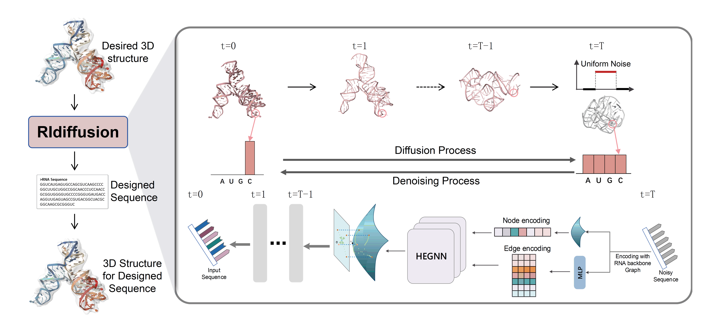

# Hyperbolic Discrete Diffusion Model for 3D RNA Inverse Folding

## 🔬 About RIdiffusion

**RIdiffusion** is a hyperbolic discrete diffusion model designed for **3D RNA inverse folding**. Unlike traditional RNA design models that primarily focus on secondary structures, RIdiffusion integrates **geometric deep learning** and **hyperbolic embedding** to efficiently generate RNA sequences that fold into complex 3D structures.

### Key Features:

- **Hyperbolic Space Representation**: Captures intricate RNA 3D structures more effectively than Euclidean methods.
- **Discrete Diffusion Process**: Enhances sequence recovery accuracy for inverse folding.
- **Generative Model**: Outperforms existing state-of-the-art (SOTA) approaches in **low-data** scenarios.
- **Optimized for Functional RNA Design**: Enables novel sequence generation for biotechnological and biomedical applications.

This repository provides a demo script to set up the environment, preprocess datasets, and run RIdiffusion for generating RNA sequences based on RNA 3D backbone.

Below is an overview of the RIdiffusion architecture: 

------

## 🛠 Requirements

### Dependencies

Ensure you have **Python 3.9 or later** installed. The main dependencies include:

- `torch==2.5.0`
- `torch-geometric==2.6.1`
- `torch-cluster==1.6.3`
- `torch-scatter==2.1.2`
- `torch-sparse==0.6.18`
- `torch-spline-conv==1.2.2`

### Installation Guide

To set up your environment, use the following commands:

```bash
# 1. Create and activate a Conda environment
conda create --name RIdiffusion python=3.10 -y
conda activate RIdiffusion

# 2. Install PyTorch (adjust versions according to your CUDA compatibility)
pip install torch==2.5.0 torchvision==0.20.0 torchaudio==2.5.0 --index-url https://download.pytorch.org/whl/cu118

# 3. Install PyTorch Geometric dependencies (compatible with PyTorch 2.5.0 & CUDA 11.8)
pip install torch-scatter torch-sparse torch-cluster torch-spline-conv -f https://pytorch-geometric.com/whl/torch-2.5.0+cu118.html

# 4. Install PyTorch Geometric
pip install torch-geometric

# 5. Install additional required libraries
pip install ema-pytorch pandas matplotlib einops seaborn biopython rdkit scikit-learn
```

> **Note:** Modify the dependency versions based on your **CUDA** and **PyTorch** setup.

------

## 📂 Dataset and Preprocessing

### 1. Download Dataset

Move to the dataset source folder:

```bash
cd ./dataset_src/
```

Download the dataset from [Google Drive](https://drive.google.com/file/d/1LXayUQP24WGxrbPABEwVvMgINCHYUM_D/view?usp=sharing) and place it in `./dataset_src/`.

### 2. Extract Dataset

```bash
tar -zxvf preprocessed_dataset.tar.gz
```

### 3. Generate Graph Data

Run the following command to generate **graph files**, which will be stored in `graph_dataset/`:

```bash
cd ..
python generate_graph_ss.py
```

------

## 🎯 Running the Experiments

To generate RNA sequences based on **PDB structures** in `./pdb/`, run:

```bash
python seq_generator.py
```

This will generate structured sequence outputs as described in the original manuscript.

